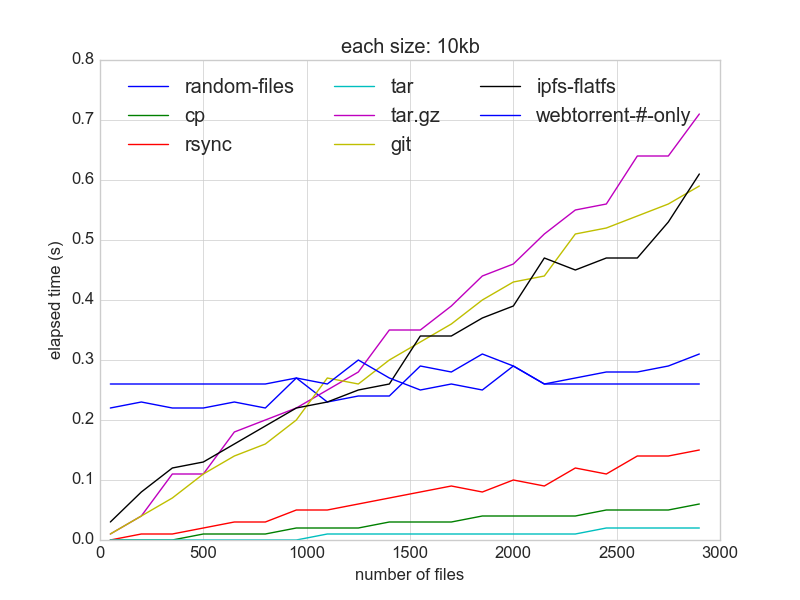
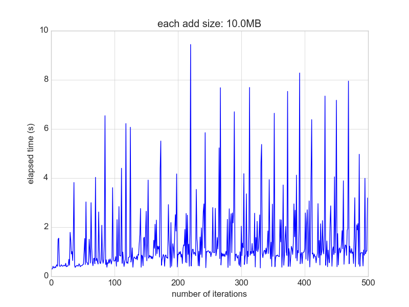
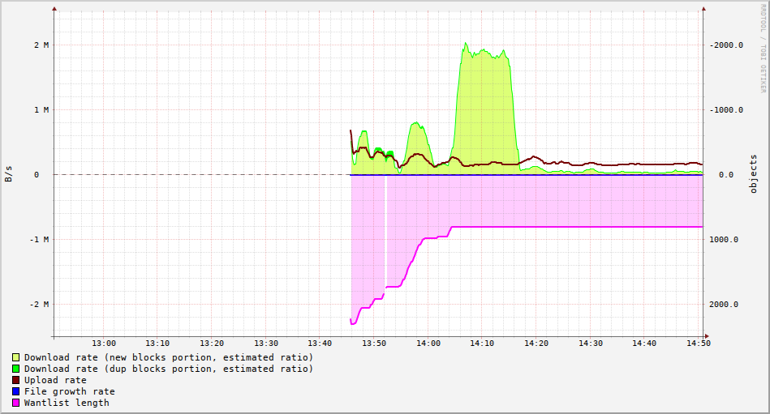
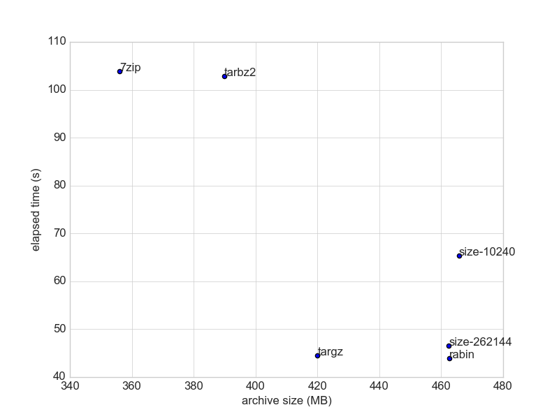
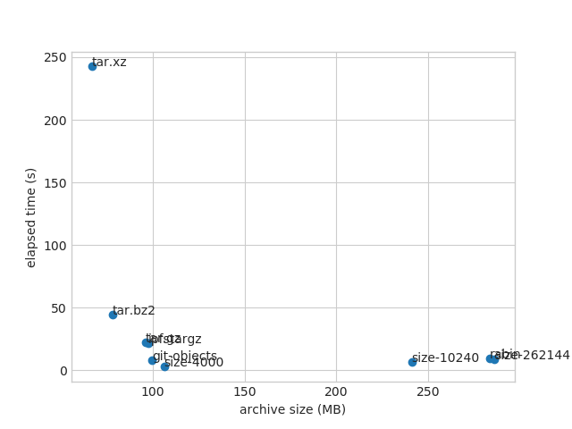
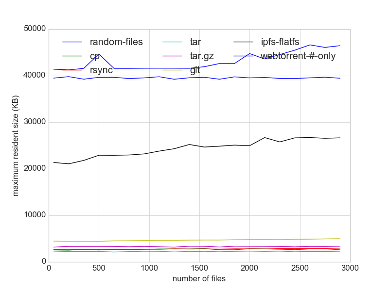
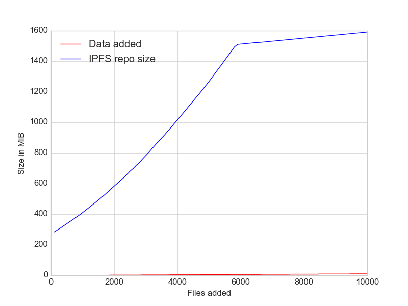

# sfpi-benchmark

USAGE: run `make` to build graph, `make clean && make` to rerun the benchmark  
TODO: this should be structured just like the sharness test  
TODO: use ipfs sandboxing from sharness  
dependencies: go-ipfs, curl, rrdtool, jq, python3, matplotlib, numpy

#add

- Add performance of many small files on ipfs, compared to various tools.  
  data: 10 kb each of files up to 3000 files


- Add performance repeatedly over a growing repo size  
  https://github.com/ipfs/go-ipfs/issues/3545


#bitswap

- (SOLVED) An automated version of https://github.com/ion1/ipfs-benchmark (@ion1)  



#chunking

- Comparison of chunking scheme (default is size-262144)  
  data: president's daily brief



#lbfs

- Reconstruct the LBFS benchmark. Highly redundant sources are now emacs 20.1, 20.2, 20.3, 20.4, 24.4, 24.5. The run is almost like the chunking benchmark except that each emacs version is archived separately. A literal bandwidth run is not necessary since counting the bandwidth cost of sending each emacs versions are equivalent to their total size. In this case, one would conclude that the bandwidth-saving due to compression outweights the duplications in the compressed archives are duplicated. Still pending double-verification if this is true. (note: the size-4000 datapoint should be disregarded since it errored out for file descriptor errors)



#gc

- https://github.com/ipfs/go-ipfs/issues/3462 (@kevina)

#go-ipfs binary size

TODO: automatically generate this report
```shell
$ du -b $f | awk -F ' ' '{ print $1 }'
```
24 MB on 'go-ipfs version: 0.4.5-pre2-'

#memory

Memory consumption of `ipfs add` compared to various tools
data: 10 kb each of files up to 3000 files


#repo size growth
- Repo size after pinned add  
  https://github.com/ipfs/go-ipfs/issues/3621  
  https://ipfs.io/ipfs/QmcsrSRuBmxNxcEXjMZ1pmyRgnutCGwfAhhnRfaNn9P94F (@mguentner)



- Repo size after being added through files api  
  https://github.com/ipfs/go-ipfs/issues/3254


