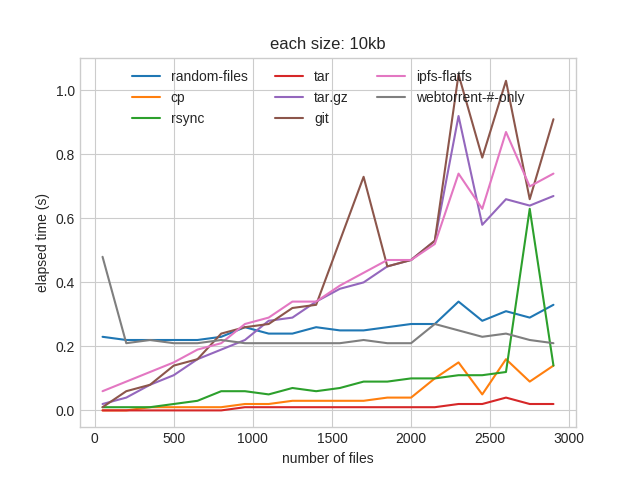
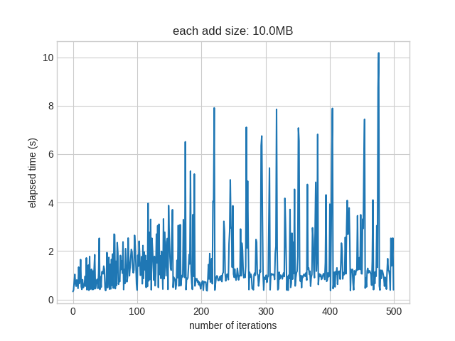
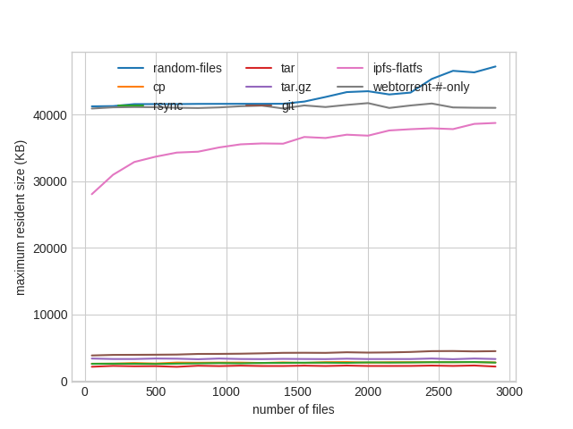
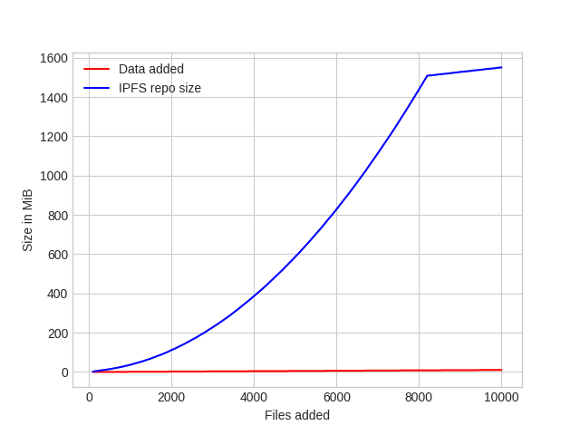
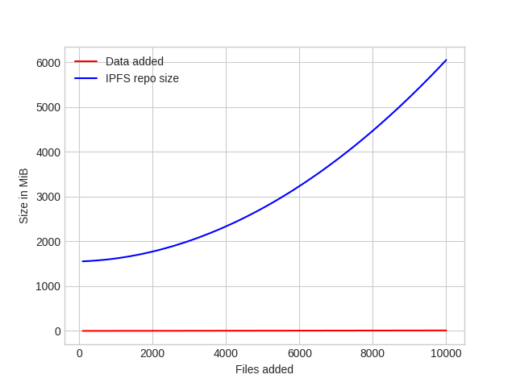

# sfpi-benchmark

USAGE: run `make` to build graph, `make clean && make` to rerun the benchmark  
TODO: this should be structured just like the sharness test  
TODO: use ipfs sandboxing from sharness  
dependencies: go-ipfs, curl, rrdtool, jq, python3, matplotlib, numpy

#add

- Add performance of many small files on ipfs, compared to various tools.  
  data: 10 kb each of files up to 3000 files


- Add performance repeatedly over a growing repo size  
  https://github.com/ipfs/go-ipfs/issues/3545


#bitswap

- (SOLVED) An automated version of https://github.com/ion1/ipfs-benchmark (@ion1)  


#gc

- https://github.com/ipfs/go-ipfs/issues/3462 (@kevina)

#go-ipfs binary size

TODO: automatically generate this report
```shell
$ du -b $f | awk -F ' ' '{ print $1 }'
```
24 MB on 'go-ipfs version: 0.4.5-pre2-'

#memory

Memory consumption of `ipfs add` compared to various tools
data: 10 kb each of files up to 3000 files


#repo size growth
- Repo size after pinned add  
  https://github.com/ipfs/go-ipfs/issues/3621  
  https://ipfs.io/ipfs/QmcsrSRuBmxNxcEXjMZ1pmyRgnutCGwfAhhnRfaNn9P94F (@mguentner)



- Repo size after being added through files api  
  https://github.com/ipfs/go-ipfs/issues/3254


